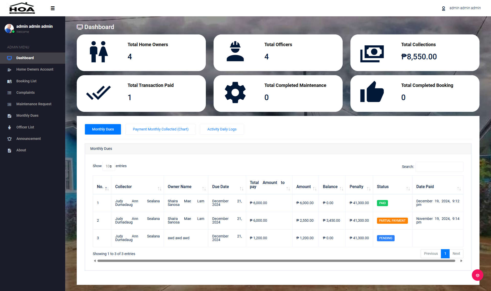

HOMEOWNERS-ASSOCIATION-MANAGEMENT-SYSTEM

(Web Application)

📄 Description

HOMEOWNERS-ASSOCIATION-MANAGEMENT-SYSTEM is a web-based application designed to streamline the management and daily operations of a homeowners association (HOA). The system provides a centralized platform for managing residents, properties, association dues, payments, announcements, and community-related records.

It aims to reduce manual paperwork, improve transparency between the association and homeowners, and enhance overall community management efficiency. Built using Laravel, the system follows modern development practices and is suitable for real-world deployment, academic projects, and portfolio use.

🚀 Features
🏘️ Association Management

Homeowner and resident records

Property and unit management

HOA member profiles

💰 Billing & Payments

Monthly and recurring dues management

Payment tracking and history

Outstanding balance monitoring

📢 Community Management

Announcements and notices

Community events tracking

Document and record management

👥 User & Access Control

Secure user authentication

Role-based access (Admin, Treasurer, Homeowner)

Profile and account management

🛠️ Tech Stack

Backend: Laravel

Frontend: Blade / Bootstrap 5

Database: MySQL / SQL Server

Authentication: Laravel Auth

Server: Apache / Nginx / IIS

📂 Project Structure
├── app/
│   ├── Http/
│   │   ├── Controllers/
│   │   ├── Middleware/
│   │   └── Requests/
│   ├── Models/
│   └── Services/
├── database/
│   ├── migrations/
│   └── seeders/
├── routes/
│   ├── web.php
│   └── api.php
├── resources/
│   ├── views/
│   └── js/
├── public/
├── .env
├── composer.json
└── README.md

⚙️ Installation & Setup
1️⃣ Clone the repository
git clone https://github.com/your-username/HOMEOWNERS-ASSOCIATION-MANAGEMENT-SYSTEM.git
cd HOMEOWNERS-ASSOCIATION-MANAGEMENT-SYSTEM

2️⃣ Install dependencies
composer install

3️⃣ Environment configuration
cp .env.example .env
php artisan key:generate

Update your database settings in .env:

DB_CONNECTION=mysql
DB_HOST=127.0.0.1
DB_PORT=3306
DB_DATABASE=hoa_management_db
DB_USERNAME=root
DB_PASSWORD=

4️⃣ Run database migrations
php artisan migrate

5️⃣ Run the application
php artisan serve

Open in browser:

http://127.0.0.1:8000

🔐 User Roles

Admin – Full system control and configuration

Treasurer – Billing and payment management

Homeowner – View dues, payments, and announcements

🧪 Testing
php artisan test

📈 Future Enhancements

Online payment gateway integration

Mobile app support

Notification system (email/SMS)

Reporting and financial analytics

Document uploads and e-signatures

Clean Architecture refactor

🤝 Contribution

Contributions are welcome!

Fork the repository

Create a feature branch

Commit your changes

Submit a pull request

📄 License

This project is licensed under the MIT License.

👨‍💻 Author

Kee Ken
Laravel & ASP.NET Developer
📍 Philippines
